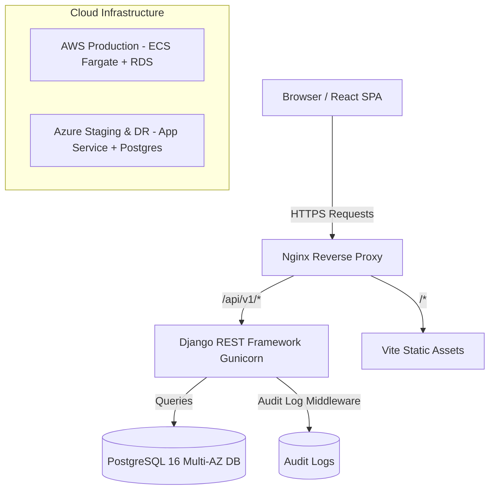

# Multi-Cloud College Management & Student Services Platform

[](https.github.com/mrinmoy/multi-cloud-college-platform/actions)
[](LICENSE)
[](https://www.python.org/)
[](https://reactjs.org/)

An enterprise-grade, production-style **Multi-Cloud College Management & Student Services Platform** built with **React (Vite)**, **Django REST Framework**, **PostgreSQL**, **Docker**, **Nginx**, **GitHub Actions CI/CD**, and Multi-Cloud Infrastructure (AWS Production & Azure Staging/Disaster Recovery).

Project timeline: started on 3 April 2026 and ended on 27 May 2026.

---

## 🏛️ System Architecture



---

## ✨ Key Features & RBAC Matrix

The system implements strict **Role-Based Access Control (RBAC)** across 5 distinct roles:

| Module | Super Admin | College Admin | Faculty | Staff | Student |
| :--- | :---: | :---: | :---: | :---: | :---: |
| **System Audit Logs** | ✅ Full Access | ✅ View Only | ❌ | ❌ | ❌ |
| **Student Profiles** | ✅ Full Access | ✅ Full Access | 👁️ View Only | ✅ Register/Edit | 👁️ Self Profile |
| **Course & Subjects** | ✅ Manage | ✅ Manage | 👁️ View Assigned | 👁️ View | 👁️ View Catalog |
| **Attendance Portal** | ✅ Overview | ✅ Overview | 📝 Mark Attendance | ❌ | 👁️ View Percentage |
| **Timetable Schedule**| ✅ Manage | ✅ Manage | 👁️ Class Schedule | 👁️ View | 👁️ View Schedule |
| **Notices & Feed** | ✅ Publish | ✅ Publish | 👁️ Read & Target | 📝 Publish | 👁️ Read Feed |

---

## 🚀 Quick Start (Local Setup)

### Prerequisites
- **Python 3.11+**
- **Node.js v20+**
- **Git**

### 1. Backend Setup
```bash
# Navigate to backend and create virtual environment
python -m venv venv
source venv/bin/activate  # On Windows: .\venv\Scripts\activate

# Install dependencies
pip install -r backend/requirements.txt

# Run migrations and seed initial demo data
python backend/manage.py migrate
python backend/manage.py seed_data

# Start Django Development Server
python backend/manage.py runserver
```
*Backend API available at: `http://localhost:8000/api/v1/`*  
*Swagger Documentation: `http://localhost:8000/api/docs/`*

### 2. Frontend Setup
```bash
# Navigate to frontend and install packages
cd frontend
npm install

# Start Vite Development Server
npm run dev
```
*Frontend Portal available at: `http://localhost:3000/`*

---

## 🔑 Demo Login Credentials

The `seed_data` command populates initial enterprise accounts:

| Role | Username | Password | Access Privileges |
| :--- | :--- | :--- | :--- |
| **Super Admin** | `superadmin` | `admin123` | Platform global management & audit trail |
| **College Admin** | `collegeadmin` | `admin123` | Department & academic administration |
| **Faculty** | `dr_smith` | `admin123` | Class session & attendance marking |
| **Staff** | `staff_john` | `admin123` | Student registration & notices |
| **Student** | `alice_student` | `admin123` | Student self-service portal |

---

## 🐳 Containerized Deployment (Docker Compose)

To launch the complete multi-container stack locally:
```bash
# Launch Database, Backend API, and Nginx Frontend
docker-compose -f docker/docker-compose.yml up --build -d
```

---

## 🌩️ Multi-Cloud Deployment Strategy

- **AWS (Production)**: Primary production environment using **AWS ECS Fargate**, **Multi-AZ RDS PostgreSQL**, **Application Load Balancer**, and **Route 53**. Infrastructure code located in `infrastructure/aws/`.
- **Microsoft Azure (Staging & Failover)**: Staging and disaster recovery environment using **Azure App Service**, **Azure Database for PostgreSQL Flexible Server**, and **Azure Front Door**. Infrastructure code located in `infrastructure/azure/`.

---

## 📚 Technical Documentation

- 📖 [Architecture Guide](docs/ARCHITECTURE.md)
- 🚀 [Deployment & Multi-Cloud Guide](docs/DEPLOYMENT.md)
- 📡 [API Specification & Endpoints](docs/API.md)
- 🔐 [Security & RBAC Controls](docs/SECURITY.md)
- 🧪 [Testing & Verification Strategy](docs/TESTING.md)
- 🤝 [Contributing Guidelines](docs/CONTRIBUTING.md)
- 🔧 [Troubleshooting Guide](docs/TROUBLESHOOTING.md)
- 🚀 [Developer Onboarding](docs/ONBOARDING.md)
