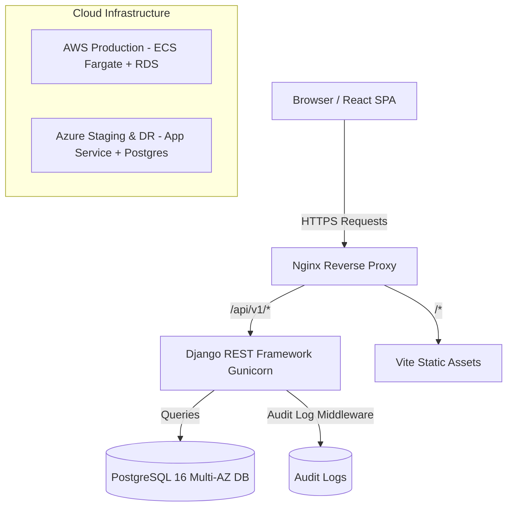

  

  <h1>Multi-Cloud College Management & Student Services Platform</h1>

  

    An enterprise-grade, highly scalable platform designed to streamline academic operations, automate attendance tracking, and empower students with self-service tools. Built on a robust Multi-Cloud architecture for maximum reliability.
  

  

    <a href="#-key-features">Features</a> • 
    <a href="#-tech-stack">Tech Stack</a> • 
    <a href="#-system-architecture">Architecture</a> • 
    <a href="SETUP.md">Setup Guide</a> • 
    <a href="DOCUMENTATION.md">Documentation Hub</a>
  

  

    
    
    
    
  

---

## 🌟 Overview

The **EduCloud Platform** transforms traditional college administration by providing a unified digital workspace. It serves as a central hub where **Super Admins, College Admins, Faculty, Staff, and Students** can interact seamlessly. From managing complex academic curriculums to tracking daily student attendance and broadcasting urgent notices, this platform handles it all with secure, role-based access.

---

## ✨ Key Features

### 🔐 Robust Role-Based Access Control (RBAC)
Experience tailored dashboards and feature sets based on your role. A strict permissions system ensures data security and operational integrity.

| Feature Area | Super Admin | College Admin | Faculty | Staff | Student |
| :--- | :---: | :---: | :---: | :---: | :---: |
| **System Audit Logs** | ✅ Full Access | ✅ View Only | ❌ | ❌ | ❌ |
| **Student Profiles** | ✅ Full Access | ✅ Full Access | 👁️ View Only | ✅ Register/Edit | 👁️ Self Profile |
| **Course & Subjects** | ✅ Manage | ✅ Manage | 👁️ View Assigned | 👁️ View | 👁️ View Catalog |
| **Attendance Portal** | ✅ Overview | ✅ Overview | 📝 Mark Attendance | ❌ | 👁️ View Percentage |
| **Timetable Schedule**| ✅ Manage | ✅ Manage | 👁️ Class Schedule | 👁️ View | 👁️ View Schedule |
| **Notices & Feed** | ✅ Publish | ✅ Publish | 👁️ Read & Target | 📝 Publish | 👁️ Read Feed |

### 🛠️ Core Modules
- **Academic Catalog**: Manage departments, degree programs, and subject curriculums dynamically.
- **Attendance Engine**: Empower faculty with rapid bulk-attendance marking and provide students with real-time percentage analytics.
- **Dynamic Timetable**: A color-coded, intuitive weekly schedule matrix.
- **Targeted Notices**: Publish urgent announcements targeting specific roles (e.g., *Faculty Only* or *All Students*).
- **Security First**: Immutable system audit trails track every crucial action (IP, User, Action) to ensure compliance.

---

## 💻 Tech Stack

Our platform is engineered using modern, industry-standard technologies to ensure high performance and maintainability.

### Frontend
- **Framework**: React 18 (Bootstrapped with Vite for lightning-fast HMR)
- **Styling**: Vanilla CSS Design System with Native Light/Dark Mode support
- **HTTP Client**: Axios with automatic JWT interceptors
- **Icons**: Lucide React

### Backend
- **Framework**: Django 5.1 & Django REST Framework (DRF)
- **Database**: PostgreSQL 16
- **Authentication**: JWT (JSON Web Tokens) via `rest_framework_simplejwt`
- **Testing**: Pytest & Django TestCase

### DevOps & Infrastructure
- **Containerization**: Docker & Docker Compose (Multi-stage builds)
- **Web Server**: Nginx Reverse Proxy & Gunicorn WSGI
- **CI/CD**: GitHub Actions (Linting, Testing, Security Scanning, Deployment)
- **Infrastructure as Code (IaC)**: Terraform
- **Cloud Providers**: AWS (Primary Production) & Microsoft Azure (Staging & Failover)

---

## 🏛️ System Architecture

Our Multi-Cloud strategy ensures zero downtime and rapid failover capabilities.

---

## 🚀 Getting Started

Ready to dive in? Head over to our **[Setup & Installation Guide (SETUP.md)](SETUP.md)** for clear, step-by-step instructions on how to run the application locally or via Docker.

---

## 📚 Documentation

We believe in great documentation. Check out our **[Documentation Hub (DOCUMENTATION.md)](DOCUMENTATION.md)** to find detailed guides on everything from our API specifications to our deployment strategies.

**Quick Links:**
- 📖 [Architecture Blueprint](docs/ARCHITECTURE.md)
- 📡 [API Specification](docs/API.md)
- 🤝 [Contributing Guidelines](docs/CONTRIBUTING.md)

---

  <i>Built with ❤️ for Modern Education.</i>

